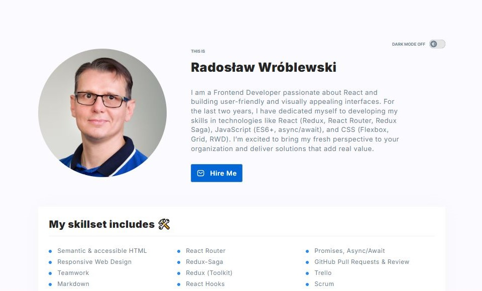

# Personal-homepage

## Demo

[Personal Homepage](https://wroblewskisoftware.github.io/personal-homepage/)

## Description

Welcome to my website – my interactive CV and portfolio! Here, you will find information about me, my skills, and the technologies I plan to learn next. I showcase both my projects and those I have contributed to.
If you're looking for a Junior Frontend Developer to join your team, feel free to contact me – I’m open to new challenges! This site was designed based on a Figma mockup, and its purpose is to demonstrate my skills and passion for programming. Check out my portfolio and click "Hire me" if you have a job opportunity for me!

The quality of my work is overseen by [Krzysztof Dąbrowski](https://www.linkedin.com/in/dabrowskisoftware) - an experienced Senior Software Engineer.

## Technologies

- Semantic HTML
- NPM
- React
- Create React App
- React-Saga
- Redux Toolkit
- JavaScript: ES6+
- GitHub API (fetch)
- Custom Hooks
- Local Storage
- Responsive Web Design
- Styled Components
- Media Queries
- CSS Grid
- CSS Flexbox

## Additional information

This project was bootstrapped with [Create React App](https://github.com/facebook/create-react-app).

## Available Scripts

In the project directory, you can run:

### `npm start`

Runs the app in the development mode.\
Open [http://localhost:3000](http://localhost:3000) to view it in your browser.

The page will reload when you make changes.\
You may also see any lint errors in the console.

### `npm run build`

Builds the app for production to the `build` folder.\
It correctly bundles React in production mode and optimizes the build for the best performance.

The build is minified and the filenames include the hashes.\
Your app is ready to be deployed!

See the section about [deployment](https://facebook.github.io/create-react-app/docs/deployment) for more information.

### `npm run eject`

**Note: this is a one-way operation. Once you `eject`, you can't go back!**

If you aren't satisfied with the build tool and configuration choices, you can `eject` at any time. This command will remove the single build dependency from your project.

Instead, it will copy all the configuration files and the transitive dependencies (webpack, Babel, ESLint, etc) right into your project so you have full control over them. All of the commands except `eject` will still work, but they will point to the copied scripts so you can tweak them. At this point you're on your own.

You don't have to ever use `eject`. The curated feature set is suitable for small and middle deployments, and you shouldn't feel obligated to use this feature. However we understand that this tool wouldn't be useful if you couldn't customize it when you are ready for it.
